<!-- ========================================================= -->

<!--                    PROFILE HERO BANNER                    -->

<!-- ========================================================= -->

<p align="center">
  
</p>

<!-- ========================================================= -->

<!--                         INTRO                             -->

<!-- ========================================================= -->

<h1 align="center">Hi 👋, I'm RITHISH S.</h1>

<h3 align="center">
  Java Backend Developer • Spring Boot • REST APIs • Databases • Cloud
</h3>

<p align="center">
  <a href="https://github.com/rimi-hash">
    
  </a>
  <a href="https://linkedin.com/in/rimi-java">
    
  </a>
  <a href="mailto:rithxh@gmail.com">
    
  </a>
</p>

---

## 👨‍💻 About Me

I'm a **final-year Computer Science & Engineering student** focused on becoming a strong **Java Backend Developer**.

I enjoy building backend systems that are structured, scalable, and easy to maintain — from designing REST APIs and working with relational databases to containerizing applications and exploring cloud deployment.

```text
Currently building with
├── ☕ Java
├── 🌱 Spring Boot
├── 🔗 REST APIs
├── 🗄️ MySQL
├── 🧩 JPA / Hibernate
├── 🐳 Docker
├── ☁️ AWS
└── 🔧 Git & GitHub
```

🎯 **Current Focus:** Production-ready Java backend development
🚀 **Learning:** Spring Boot • System Design • Docker • AWS • DevOps
💡 **Interested in:** Backend Engineering • APIs • Cloud • Scalable Systems
📍 **Based in:** India

---

## 🛠️ Tech Stack

### Backend

<p>
  
</p>

### Database

<p>
  
</p>

### Cloud & DevOps

<p>
  
</p>

### Development Tools

<p>
  
</p>

### Also Exploring

<p>
  
</p>

---

## 🚀 Featured Projects

### 🔹 TaskFlow API

A production-style task management REST API built with Java and Spring Boot.

**Highlights**

* RESTful API architecture
* Spring Boot
* Spring Data JPA
* Hibernate
* MySQL
* DTO-based request/response design
* Input validation
* Global exception handling
* CRUD operations
* REST API testing with Postman

**Tech:** `Java` `Spring Boot` `JPA` `Hibernate` `MySQL` `Maven`

---

### 🔹 USB Forensics & Monitoring Toolkit

A security-focused monitoring and forensic toolkit designed to monitor USB activity and assist with forensic analysis.

**Highlights**

* USB event monitoring
* Python-based client
* Administrative GUI
* SQLite database
* Linux forensic utilities
* Regex-based analysis
* Digital forensic investigation workflow

**Tech:** `Python` `PyQt` `SQLite` `Linux Forensics` `Autopsy` `Sleuth Kit`

---

### 🔹 Fuzzinator

A security-oriented fuzzing toolkit designed for discovering unexpected application behavior through automated input testing.

**Tech:** `Python` `Security Testing` `Fuzzing`

---

## 📚 Currently Learning

```text
Java Backend Engineering
        │
        ├── Spring Boot
        │     ├── REST APIs
        │     ├── Validation
        │     ├── Exception Handling
        │     └── Security
        │
        ├── Database Engineering
        │     ├── MySQL
        │     ├── JPA
        │     └── Hibernate
        │
        ├── Cloud
        │     └── AWS
        │
        └── DevOps
              ├── Docker
              ├── CI/CD
              └── Deployment
```

---

## 💻 What I Like Building

```text
REST APIs
Backend Services
Database-driven Applications
Authentication Systems
Cloud-ready Applications
Containerized Applications
Developer Tools
Security-focused Applications
```

---

## 📊 GitHub

<p align="center">
  
  
</p>

<p align="center">
  
</p>

---

## 🧠 My Development Philosophy

> **Build it. Understand it. Improve it.**

I believe in learning by building real applications, understanding what happens behind the abstractions, and continuously improving the way I write and deploy software.

---

## 🤝 Let's Connect

<p align="center">

<a href="https://github.com/rimi-hash">
  
</a>

<a href="https://linkedin.com/in/rimi-java">
  
</a>

<a href="mailto:rithxh@gmail.com">
  
</a>

</p>

---

<p align="center">
  <i>Building backend systems one API at a time ☕</i>
</p>
